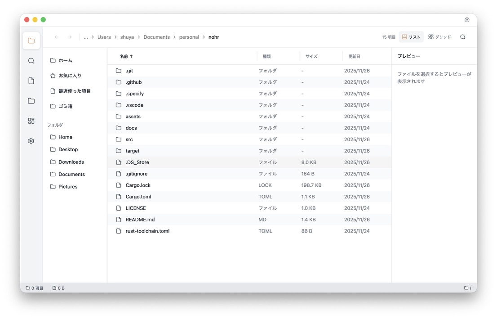

<div align="center">
  

  # Nohrs

  **Launcher × Explorer** — a fast, extensible, plugin-ready file workspace for macOS, built in Rust.

  [](https://github.com/noh-rs/nohrs/actions/workflows/ci.yml)
  [](LICENSE)
  [](rust-toolchain.toml)
  [](https://www.apple.com/macos)
  [](https://discord.gg/dZM7fUtE94)

  [Quick Start](#quick-start) · [Why Nohrs?](#why-nohrs) · [Roadmap](docs/ROADMAP.md) · [日本語 README](docs/README.ja.md)

  
</div>

Nohrs combines a Raycast-style launcher and a modern, keyboard-driven file explorer in a single app — a Finder alternative that stays fast, scriptable, and extensible through sandboxed plugins.

## Demo

<div align="center">
  
</div>

> A demo GIF is on the way. Until then, build from source (see [Quick Start](#quick-start)) to try it locally.

## Why Nohrs?

- **Launcher first-class** — a built-in launcher you can summon from a global hotkey, not bolted on after the fact.
- **Explorer first-class** — split view, tabs, drag-and-drop, and bulk operations expected of a modern file manager.
- **WASM Component Model plugins** — extend Nohrs in Rust, TypeScript, or Python, running sandboxed under an explicit-consent permission model.
- **Search without Spotlight** — a self-contained SQLite + Tantivy hybrid index, with no dependency on the OS search daemon and first-class code-base awareness.

See the [Roadmap](docs/ROADMAP.md#ビジョン) for how these pillars map to releases.

## Quick Start

### Install (macOS)

Nohrs is **pre-alpha** and not yet published. Once the first release ships:

```sh
# Planned — not available yet
cargo install nohrs
```

Prebuilt macOS binaries will appear on the [Releases](https://github.com/noh-rs/nohrs/releases) page. For now, build from source.

### Build from source

```sh
# Toolkit-free crates only (core / models / services) — this is what Linux CI builds
cargo build

# Full workspace, including the GUI crates and binary
# (requires gpui's platform toolchain; macOS recommended — see below)
cargo build --workspace
cargo run -p nohrs
```

#### macOS prerequisites for gpui

gpui renders with Metal on macOS, so Xcode and the Metal toolchain are required:

1. Install Xcode from the App Store (launch it once to finish setup).
2. Install the command line tools: `xcode-select --install`
3. Point the CLI at the installed Xcode: `sudo xcode-select --switch /Applications/Xcode.app/Contents/Developer`
4. If the build reports a missing Metal toolchain: `xcodebuild -downloadComponent MetalToolchain`

> For Linux native, Nix, and Docker setups, see the [recommended setup matrix](docs/dev-environment.md#1-推奨セットアップ早見表).

## Status

**Pre-alpha (v0.x).** The app is under active development and APIs, UI, and data formats will change without notice. The current GUI is an early entry point being wired up to gpui. Expect rough edges, and please file issues.

## Roadmap

Nohrs ships in six serial phases from `v0.2.0` to `v0.7.0`. Highlights:

| Phase | Milestone | Theme |
|-------|-----------|-------|
| **P1** | `v0.2.0` | Foundation — quality, workspace split, dev/CI infra, web MVP |
| **P2** | `v0.3.0` | Explorer Essentials — DnD, file ops, split view, tabs, persistence |
| **P3** | `v0.4.0` | Launcher & Search — global-hotkey launcher, SQLite FTS5 search |
| **P4** | `v0.5.0` | Plugin Host — WASM Component Model, 3-language templates |
| **P5** | `v0.6.0` | Ecosystem — Plugin Store, community plugins |
| **P6** | `v0.7.0` | Stabilization — multi-OS strategy, performance gates, docs |

Full details, vision, and design docs live in [`docs/ROADMAP.md`](docs/ROADMAP.md).

## Community

- **Discord**: https://discord.gg/dZM7fUtE94
- **X (Twitter)**: https://x.com/nohrsdotapp
- **GitHub**: https://github.com/noh-rs/nohrs

Contributions are welcome — open an issue or a pull request.

## License

Released under the [MIT License](LICENSE).
