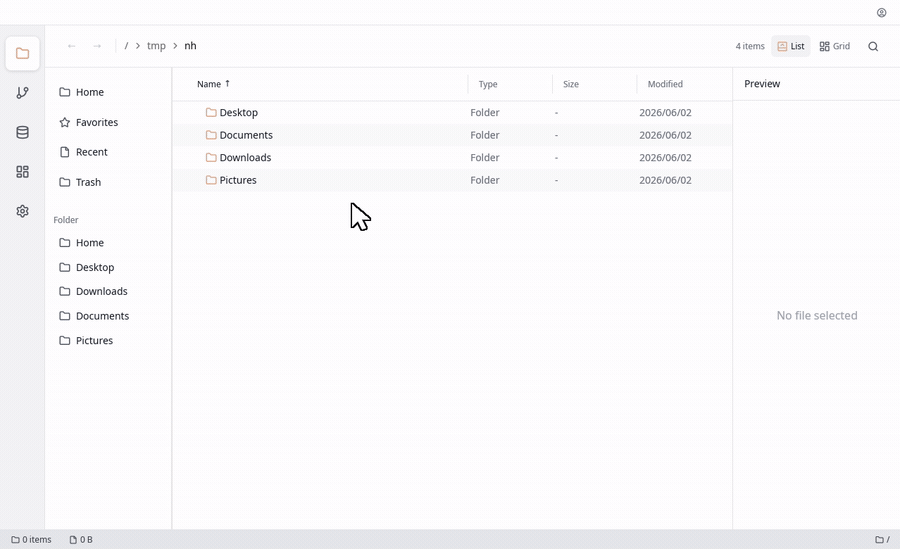

<div align="center">
  

  # Chronos-FM

  **Launcher × Explorer** — a fast, extensible, plugin-ready file workspace, built in Rust with [GPUI](https://gpui.rs).

  [](https://github.com/Dark-Ohm/chronos-fm/actions/workflows/cachy.yml)
  [](LICENSE)
  [](rust-toolchain.toml)
  [](https://cachyos.org)
  [](https://discord.gg/dZM7fUtE94)

  [Quick Start](#quick-start) · [Why Chronos-FM?](#why-chronos-fm) · [Roadmap](docs/ROADMAP.md) · [日本語 README](docs/README.ja.md)

  
</div>

Chronos-FM combines a Raycast-style launcher and a modern, keyboard-driven file explorer in a single app — a Finder alternative that stays fast, scriptable, and extensible through sandboxed plugins.

## Demo

<div align="center">
  
</div>

## Why Chronos-FM?

- **Launcher first-class** — a built-in launcher you can summon from a global hotkey, not bolted on after the fact.
- **Explorer first-class** — split view, tabs, drag-and-drop, and bulk operations expected of a modern file manager.
- **WASM Component Model plugins** — extend Chronos-FM in Rust, TypeScript, or Python, running sandboxed under an explicit-consent permission model.
- **Search without Spotlight** — a self-contained SQLite + Tantivy hybrid index, with no dependency on the OS search daemon and first-class code-base awareness.

See the [Roadmap](docs/ROADMAP.md#ビジョン) for how these pillars map to releases.

## Quick Start

### Install (macOS)

Chronos-FM is **pre-alpha** and not yet published. Once the first release ships:

```sh
# Planned — not available yet
cargo install chronos-fm
```

Prebuilt Linux binaries (CachyOS / AUR) will appear on the [Releases](https://github.com/Dark-Ohm/chronos-fm/releases) page. For now, build from source.

### Build from source (Linux)

Chronos-FM builds and runs natively on Linux (GPUI with Vulkan/wgpu — tested on
CachyOS + Hyprland with the NVIDIA driver).

```sh
# One-time: create unversioned dev-lib symlinks so GPUI links without root
bash script/ui-run.sh setup

# Build the GUI binary
RUSTFLAGS="-L $HOME/.local/devlibs" cargo build -p chronos-fm

# Run it (from a Wayland/X11 session)
./target/debug/chronos-fm
# or, to (re)launch headless and wait for first render:
bash script/ui-run.sh launch
```

The toolkit-free crates (`core`, `models`, `services`, `store`) build everywhere
with a plain `cargo build`. For Nix/Docker setups see
[docs/dev-environment.md](docs/dev-environment.md).

## Status

**Pre-alpha (v0.x).** The app is under active development and APIs, UI, and data formats will change without notice. The current GUI is an early entry point being wired up to gpui. Expect rough edges, and please file issues.

## Roadmap

Chronos-FM ships in six serial phases. P1 iterates on `0.0.x`; the first usable MVP is cut as
`0.1.0` when P2 completes, reaching `0.5.0` by P6 and `1.0.0` at stabilization. Highlights:

| Phase | Milestone | Theme |
|-------|-----------|-------|
| **P1** | `0.0.x` | Foundation — quality, workspace split, dev/CI infra, web MVP |
| **P2** | `0.1.0` | Explorer Essentials — DnD, file ops, split view, tabs, persistence |
| **P3** | `0.2.0` | Launcher & Search — global-hotkey launcher, SQLite FTS5 search |
| **P4** | `0.3.0` | Plugin Host — WASM Component Model, 3-language templates |
| **P5** | `0.4.0` | Ecosystem — Plugin Store, community plugins |
| **P6** | `0.5.0` | Stabilization — multi-OS strategy, performance gates, docs |

Full details, vision, and design docs live in [`docs/ROADMAP.md`](docs/ROADMAP.md).

## Community

- **Discord**: https://discord.gg/dZM7fUtE94
- **X (Twitter)**: https://x.com/chronosfmdotapp
- **GitHub**: https://github.com/Dark-Ohm/chronos-fm

Contributions are welcome — open an issue or a pull request.

## License

Released under the [MIT License](LICENSE).
