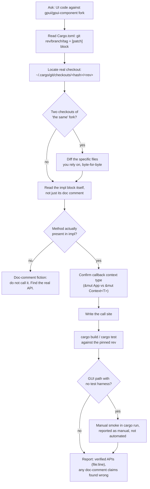

# Domain adapter: GPUI-fork consumer (building UI against a pinned Chronos-GPUI fork)

Applies when the deliverable is **application UI code in a crate that depends on `gpui` / `gpui-component` as a pinned git fork** (`Chronos-GPUI`, or any project-specific gpui-ce fork) — widgets, context menus, dialogs, event handlers, anything calling into the fork's public API from a consumer crate (chronos-fm, ChronOS, Chronos-IDE, or similar). The loop is unchanged; these definitions replace the coding defaults. **`gpui-fork-start-here`/fork-internals work** takes over when the change is *inside* the fork itself (`Source/gpui*`) — patching the renderer, adding a `WindowKind`, touching `gpui_wgpu` shaders; **plain `coding`** stays the default for pure Rust logic with no gpui surface at all; **this adapter takes over** the moment a consumer crate calls a fork API and the claim "this compiles/behaves as documented" is made without having read the pinned checkout.

## Workflow (steps + flowchart)

1. **Identify the pinned source** — read the workspace `Cargo.toml` for the exact `git = "..."`, `rev = "..."` (or `branch`/`tag`) on `gpui`/`gpui-component`, and any `[patch."https://github.com/zed-industries/zed"]` block unifying the graph. This rev, not memory of "how GPUI usually works," is the API surface.
2. **Locate the real checkout** — `~/.cargo/git/checkouts/<hash>/<rev>/` (or a `path = "../Source"` sibling). If two checkouts of "the same" fork exist (a git dep here, a path dep in a sibling project), diff the specific files you're about to rely on — do not assume they match just because the project name matches.
3. **Read the actual `impl` block, not the doc comment above it** — doc comments in vendored code can be aspirational, stale, or copied from an upstream example that no longer applies. Grep the real method list (`grep -n "pub fn " file.rs`) before writing a call using any method name.
4. **Verify the callback-context type** — this fork's callbacks are frequently `Fn(&Event, &mut Window, &mut App)`, not `&mut Context<T>`. Confirm which one a given API actually hands you before assuming you can call `self`-mutating methods directly; if it's `&mut App`, the pattern is `let entity = cx.entity(); /* later */ entity.update(cx, |state, cx| { ... })`.
5. **Act surgically** — write the call site using only methods confirmed present in Step 3, at the confirmed signature from Step 4.
6. **Verify by observation** — `cargo build`/`cargo test` against the real pinned rev (not a hand-wave "should compile"); for anything with no GUI test harness, an explicit manual-smoke checklist run in `cargo run`, reported as a manual claim, not implied to be automated.
7. **Report outcome-first** — which APIs were verified against source (name the file/line), which doc-comment claims turned out wrong (if any), what was manually smoked vs. automatically tested.

## Minimum evidence set (binding, before any call into a fork API)

1. **The pinned rev itself**: the exact `git`/`rev` (or `path`) entry in `Cargo.toml` for `gpui`/`gpui-component`. If the project has no pin (floating branch), stop and flag it — floating gpui deps make every other evidence item stale the moment `cargo update` runs.
2. **The real source at that rev**: the actual file and `impl` block for every type/method the code will call, opened via the local checkout — not recalled from a prior session, not copied from a doc comment.
3. **One cross-check when a claim seems too convenient**: if a doc comment, README, or memory suggests an API exists, grep the impl block for it before using it. A doc comment is not primary evidence in this domain (see below).

## Evidence and primary sources

Primary evidence is the **actual source file at the pinned rev** (`grep -n "pub fn "`, a diff between two checkouts claiming to be the same fork, a successful `cargo build` against that exact `Cargo.lock`). Doc comments, `///` examples, README snippets, and prior-session memory are *not* primary — they are frequently aspirational or written against a different revision, and this domain's signature failure is trusting one of them uncross-checked. Signature non-evidence: "the doc comment shows this method," "it compiled for me before" (without confirming the same pinned rev), "GPUI usually works this way."

## Authority order

Explicit user instruction > the exact pinned `rev`/`branch`/`tag` in `Cargo.toml` > the real source at that rev (impl blocks over doc comments) > `Cargo.lock`'s locked commit > upstream `zed-industries/zed` docs/source (only when the fork hasn't diverged for that file — confirm, don't assume) > crates.io `gpui` (different lineage entirely for a `gpui-ce`-style fork) > agent memory of "how GPUI works." Classic conflict: a doc comment inside the fork's own source contradicts its own `impl` block — **the `impl` block wins**; the doc comment is stale prose, not a second source of truth.

## Verification by observation

- Every method name used in new call-site code has been seen via `grep -n "pub fn <name>"` in the actual pinned-rev checkout, not only in a doc comment or in memory of a similar upstream API.
- If two checkouts of "the same" fork exist in the dependency graph (e.g. a git dep here and a path dep in a sibling project), the specific files relied on were diffed and shown identical (or the difference was reconciled) before trusting either.
- The callback-context type (`&mut App` vs `&mut Context<T>`) for any event handler was confirmed from the actual trait/fn signature, not assumed from generic GPUI familiarity — this fork's consumer-facing callbacks frequently differ from upstream zed's.
- `cargo build`/`cargo test` was actually run against the code that calls the fork, and its output (or the specific failing line) is quoted in the report — not "should build."
- Any GUI-only path with no automated test harness is reported as a manual smoke claim, explicitly labeled as such, never implied to be test-covered.

## Fraud table (for fable-judge)

| Fraud | Symptom |
|---|---|
| Doc-comment fiction | Call site uses a method that appears only in a `///` example, never in the real `impl` block |
| Upstream bleed | Code written against crates.io `gpui`/upstream `zed-industries/zed` behavior without confirming the pinned fork matches for that file |
| Sibling-checkout assumption | Two checkouts of "the same" fork (git dep + path dep, or two projects' vendored copies) treated as identical without a diff |
| Context-type guess | `cx.listener`/`Entity::update` pattern applied without checking whether the actual callback hands `&mut App` or `&mut Context<T>` |
| Floating-rev blindness | Claims verified against "the fork" with no `rev`/`branch`/`tag` named, so the claim silently expires on the next `cargo update` |
| Compiles-so-verified | "It should compile" asserted without an actual `cargo build`/`cargo test` run pasted in the report |
| Silent manual-claim | A GUI-only smoke check reported in the same voice as an automated test, with no "manual, not automated" caveat |

## Done, by example

"The context menu calls the fork's `AlertDialog`/`ContextMenu` API correctly" means: every method name was grepped in the actual pinned-rev checkout's `impl` block, any doc-comment claim that looked too convenient was cross-checked and, if wrong, flagged; `cargo build`/`cargo test` output is quoted; GUI-only paths are labeled as manual smoke, not implied automated. Not: "gpui-component has an X component, so `.method()` should work."

## Sources

- Cargo Book, "Overriding Dependencies" (`[patch]` semantics, exact-source-match requirement for unifying a forked dependency graph): https://doc.rust-lang.org/cargo/reference/overriding-dependencies.html (accessed 2026-07-21)
- Cargo Book, "Specifying Dependencies" (git `rev`/`branch`/`tag` pinning, `Cargo.lock` locking behavior for git deps): https://doc.rust-lang.org/cargo/reference/specifying-dependencies.html (accessed 2026-07-21)
- Chronos-GPUI fork repository (public; "Zed gpui + Longbridge gpui-component" combined fork used by chronos-fm/ChronOS/Chronos-IDE): https://github.com/Dark-Ohm/Chronos-GPUI (accessed 2026-07-21)
- This adapter's own minimum-evidence-set and fraud table were derived from a real incident in this project (not hypothetical): `AlertDialog::warning()` was found only in a doc-comment example, never in the real `impl AlertDialog` block, at `gpui-component/crates/ui/src/dialog/alert_dialog.rs` in the pinned `Chronos-GPUI@ee80b72` checkout — see `docs/superpowers/specs/2026-07-21-explorer-context-menu-design.md` §"Delete confirmation" for the correction record.

Companion skills (pointers only, not auto-invoke): `skills/gpui`, `skills/gpui-fork-start-here` (fork-internals, not consumer UI), `skills/chronos-shell`; `verification-before-completion` for GUI/UX-style claims with no screenshot harness.
